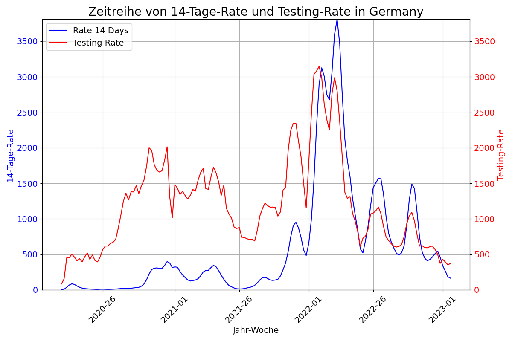

# MoSD Exam Data Management Plan
**Author:** Justin Bergmann <justin.bergmann@uni-jena.de>  
**Description:** The repository for the "Management of Scientific Data" exam containing information about the creation process of the slides as well as the data and tools used.  
**Table of Contents:**  
:sectanchors:  
:toc:  
**Repository:** [https://github.com/Smurado/MoSD_Exam](https://github.com/Smurado/MoSD_Exam)

## Summary

**Datasets:**

- **"Data on 14-day notification rate of new COVID-19 cases and deaths" (ECDC):** Weekly national data on cases, deaths, and 14-day rates (ca. 12,600 entries, ~18 MB original).  
- **"Data on testing for COVID-19 by week and country" (ECDC):** Weekly testing data including volume and positivity rates (ca. 6,100 entries, ~10 MB original).  

**Origin:** Primary from The European Surveillance System (TESSy) reported by EU/EEA Member States; secondary from public online sources (web-scraped daily by ECDC).  

**Expected End Size:** ~2.5x original after merging/cleaning (ca. 18,700 entries total in processed form).  

**Data Types:**  
- Integer (e.g., cases_weekly, tests_done)  
- Float (e.g., rate_14_day, testing_rate)  
- Strings (e.g., country, year_week)  

**Data Formats:**  
- Original: CSV, JSON, XML, XLSX  
- Processed: CSV (per country), with metadata in Markdown/PDF  

## Data Lifecycle

### Plan

1. Get an overview of all available material.  
2. Analyze the task of the exam.  
3. Create a repository to store all metadata for the exam and add project history.  
4. Select one of the given scenarios:  
   - Chosen: COVID scenario due to its relevance
5. Develop a research question:  
   - Selected: "Is there a correlation between cases and testing volume?"
6. Review datasets on the ECDC website:  
   - [Cases/Deaths Dataset](https://www.ecdc.europa.eu/en/publications-data/data-national-14-day-notification-rate-covid-19) (~12,600 entries)  
     - **Pros:** Available in multiple formats, self-explanatory CSV structure, linked GitHub repo.  
     - **Cons:** Limited metadata on the website.  
   - [Testing Volume Dataset](https://www.ecdc.europa.eu/en/publications-data/covid-19-testing) (~6,100 entries)  
     - **Pros:** Similar to cases/deaths dataset, but with more metadata.  
     - **Cons:** Both files saved as `data.csv`, requiring renaming.  
7. Select and complete a DMP template:  
   - DMP: `doc/ERC-Data-Management-Plan.pdf`  
   - Template: [Horizon Europe](https://view.officeapps.live.com/op/view.aspx?src=https:%2F%2Fwww.tuwien.at%2Ffileadmin%2FAssets%2Fforschung%2FZentrum_Forschungsdatenmanagement%2Fdata-management-plan-template_HE_2021.docx&wdOrigin=BROWSELINK)  
   - Reason: Chosen for its manageable size.
8. Create slides for the exam:  
   - Developed in Microsoft Office (due to time constraints).  
   - Available in the repository as `.pptx` and `.pdf`.  
9. Document the data lifecycle based on lecture content and Moodle resources.

### Collect

- **Source:**  
  - Reported by EU/EEA Member States to TESSy.  
  - Public online sources compiled by ECDC when TESSy data is unavailable.  
- **Auto Collection:**  
  - Not needed; data provided by ECDC, web-scraped daily (manual or automated).  
- **Purpose:** Collect data to answer the research question.  
- **Amount:** Sufficient for analysis.  
- **Representativeness:**  
  - Biased toward Europe (no non-European countries included).  
  - Data quality/noise not fully evaluable.  
- **Cost:**  
  - ECDC collection costs not transparent.  
  - No additional costs for this project (done individually).  
- **Storage:** Free GitHub repository (no storage costs).  
- **Strategy:** Minimal preprocessing (e.g., selecting time frames, countries).  
- **Data Characteristics:**  
  - Quantitative, structured, generally trustworthy (ECDC source).

### Assure

- **Completeness:**  
  - See `src/data_quality.ipynb`.  
  - Cases/Deaths: 7.63% NA values in important rows.  
  - Testing: 18.86% NA values.  
- **Uniqueness:** Ensured by data structure (one entry per week per country).  
- **Timeliness:** Fairly representative, though pandemic data may not be 100% accurate.  
- **Validity:** All columns valid; NA for missing values.  
- **Accuracy:**  
  - Weekly data avoids major date format issues.  
  - Values are sensible and expected.  
- **Consistency:**  
  - Generally good.  
  - Minor issues:  
    - EU vs. country-level entries may cause confusion.  
    - Inconsistent country codes (e.g., AUT vs. AT).  
    - `year_week` format differs (e.g., with/without leading "W").  
- **Multi-Source Issues:** Minor inconsistencies at the instance level; no major flaws.

### Describe

- Most metadata sourced from the ECDC website.  
- Testing dataset has more metadata than cases/deaths.  
- GitHub repo lacks metadata.  
- Data is self-explanatory, even for non-medical users.  
- More metadata would improve usability.

### Preserve

- **Reliability:** ECDC website is reliable, with GitHub backups (no single point of failure).  
- **Recommendation:** Upload to a research repository like Zenodo.  
- **Publication:** No indication of a published paper; unclear if data is only preserved or published.  
- **Quality Features:** Absent on the website.  
- **DOI/PID:** Not provided.  
- **Authorship:** Only repository participants listed, not dataset authors.  
- **Metadata:** Limited for preservation/publishing.  
- **Download Options:** Fully supported (CSV, XML, XLSX, JSON).  
- **Documentation:** Basic but not comprehensive.  
- **Accessibility:** Freely accessible.  
- **License:**  
  - No explicit license in the repository.  
  - ECDC website links to [copyright policy](https://www.ecdc.europa.eu/en/copyright) (compatible with CC BY 4.0).  
  - ECDC must be acknowledged as the original author.  
- **Overview:** No column name documentation.  
- **Archives:** Available for 20.06.2022 with an R script.  
- **Repository:** 42 commits, starting 01.12.2023 (end of record time frame).  
- **Indexing:** Well-indexed by Google.

#### FAIR

Most FAIR criteria are met:  
- Data is easy to find (indexed by Google and other search engines).  
- Clear structure enables quick use (with data science knowledge).  
- Freely accessible without paywalls or login.  
- Reusable, though repository lacks some website metadata (e.g., license).  
- Reference: [FAIR Principles Graphic](https://www.ccdc.cam.ac.uk/solutions/about-the-csd/fair-data-principles/).  

### Discover

- **Context:** COVID datasets are common due to the topic’s recency.  
- **Example:** [COVID-19 Vaccines Dataset](https://ourworldindata.org/covid-vaccinations) (7-day period, compatible with ECDC data).  
- **Zenodo Search:**  
  - [COVID-19 Search](https://zenodo.org/search?q=covid%2019&l=list&p=1&s=10&sort=bestmatch) yields many results.  
  - Filtered (open access, CSV, dataset): [1,559 results](https://zenodo.org/search?q=covid%2019&f=access_status%3Aopen&f=resource_type%3Adataset&f=file_type%3Acsv&l=list&p=1&s=10&sort=bestmatch).  
  - Limited regional filtering; no keywords for similar datasets.  
  - Likely uses BM25 retrieval; no stemming, special characters removed, stopwords indexed.  

### Integrate

- **Goal:** Process datasets to answer the research question.  
- **Steps:**  
  - Standardize `year_week` format (remove leading "W" in testing dataset).  
  - Merge datasets by date.
  - Remove redundant columns and NaN rows.
  - Export per-country datasets to `./data/per_country/`.  
- **Implementation:** `data_processing.ipynb` (with AI assistance for faster coding).  

### Analyze

- **Process:** Analyze one country’s dataset, designed for easy replication across countries.  
- **Tools:** `data_analysis.ipynb`, `matplotlib` (see Tools section).  
- **Findings:** Rising test cases correlate with higher 14-day COVID-19 rates, indicating testing’s role in disease management.  

## Data Description

### Cases/Deaths Dataset

- **country:** String  
- **country_code:** String  
- **continent:** String  
- **population:** Integer  
- **indicator:** String (either `cases` or `deaths`)  
- **weekly_count:** Integer?  
- **year_week:** String (YYYY-WW, e.g., 2020-01)  
- **rate_14_day:** Float? (new cases per 100k citizens in 14 days)  
- **cumulative_count:** Integer?  
- **source:** String  
- **note:** String?  

### Testing Volume Dataset

- **country:** String  
- **country_code:** String  
- **year_week:** String (YYYY-WWW, e.g., 2020-W01)  
- **level:** String (always "national")  
->'region:** String (same as `country_code`)  
- **region_name:** String (same as `country`)  
- **new_cases:** Integer?  
- **tests_done:** Integer?  
- **population:** Integer  
- **testing_rate:** Float?  
- **positivity_rate:** Float?  
- **testing_data_source:** String?  

## Tools

- macOS Sequoia 15.5
- MacBook Pro 14-inch 2024
- Apple M4 Max 40-Core GPU
- 128.0 GiB RAM  
- XNU-Kernel 24.5.0
- Git  
- VS Code 1.97.0
- PyCharm 2025.1.3.1
- Office 365 for Mac
- Python 3.9.6
- Python venv, pandas 2.3.1, seaborn 0.13.2, matplotlib 3.10.3  

## Repository

[https://github.com/Smurado/MoSD_Exam](https://github.com/Smurado/MoSD_Exam)